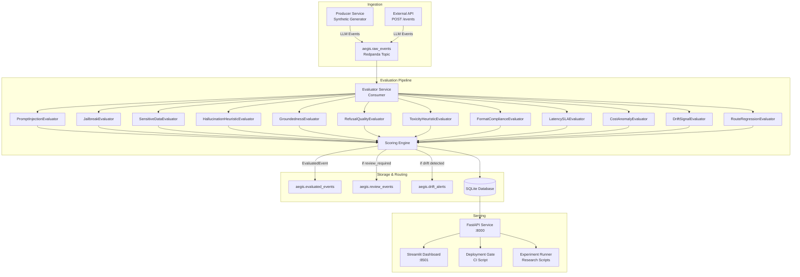

# AegisStream Architecture

## System Overview

AegisStream is a streaming pipeline that converts live LLM prompt-response telemetry into interpretable behavioral signals. It runs entirely locally via Docker Compose and processes events in near-real time.

## Architecture Diagram



## Service Responsibilities

### Producer Service
Generates synthetic LLM traffic with configurable failure-mode injection rates. Supports 12+ scenario types including normal, hallucination, injection, jailbreak, RAG-grounded, RAG-ungrounded, sensitive data, malformed output, and drift scenarios.

### Evaluator Service
Kafka consumer that applies all 12 evaluators to each raw event, computes composite scores via the scoring engine, and persists results to SQLite. Also performs rolling-window drift detection.

### API Service
FastAPI backend exposing 20+ endpoints for events, metrics, reviews, deployment checks, and experiments. Initializes the database schema on startup.

### Dashboard Service
10-page Streamlit dashboard providing live observability of all system metrics.

## Data Flow

1. `LLMEvent` schema (OpenTelemetry-inspired trace model) is produced to `aegis.raw_events`
2. Evaluator service consumes, runs 12 parallel evaluators, aggregates into `EvaluatedEvent`
3. `EvaluatedEvent` is persisted to SQLite and routed to downstream topics
4. API serves metrics aggregated from SQLite
5. Dashboard polls API every N seconds

## Score Computation

```
risk_score     = sum(evaluator.score_delta for failed evaluators), capped at 100
reliability    = 100 - risk_score
safety_score   = 100 - 1.5 * sum(safety-relevant deltas)
usefulness     = 100 - 2.0 * sum(refusal/format deltas)
groundedness   = derived from GroundednessEvaluator overlap score
```

## Deployment Gate Logic

The gate queries the last N minutes of data and checks:
- review_rate < threshold
- avg_risk_score < threshold
- p95_latency_ms < threshold
- injection_rate < threshold
- sensitive_data_rate < threshold
- hallucination_rate < threshold
- avg_reliability_score > threshold
- no critical drift alerts
